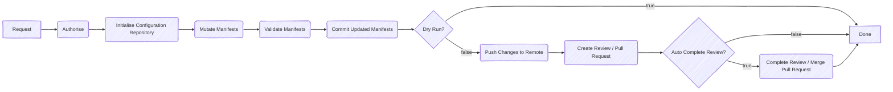

# GitOps Manager

The GitOps Manager is a Go package that allows you to easily build a GitOps bot with a client-server architecture. The server component is configured to run a predetermined flow to ensure a principled approach to managing GitOps operations.



The way in which parts of the flow work are implemented using interfaces that can be swapped out for different implementations. This allows for a high degree of customization and flexibility in how the GitOps bot operates.

## Flow Components

- [Strategies Reference](./docs/strategies.md)
- [Processors Reference](./docs/processors.md)

### Strategies
Strategies define how each step in the flow is executed.

#### Authorisor
The authorisor is responsible for authenticating and authorizing incoming requests to the GitOps bot. This could involve checking API keys, OAuth tokens, or other forms of authentication to ensure that only authorized users can trigger the GitOps operations and that they are being performed with valid payloads, e.g. targetting an allowed repository.

#### URL Authenticator
The URL authenticator is a strategy that enriches a clone URL with authentication information so that private repositories can be accessed.

#### File Copier
The file copier strategy determines how desired manifests are integrated into the configuration repository. This could be as simple as copying all files to a specified subpath, or it could involve more complex logic specific to your configuration repository's structure.

#### Committer
The committer allows you to define how commits are made to the configuration repository. This includes setting the commit message, author information, and any other metadata associated with the commit. It also allows you to control the granularity of commits by exposing the git repository and worktree.

### Reviewer
The reviewer is responsible for creating and managing code reviews or pull requests in the remote repository. This includes defining the title and description of the review, as well as handling the submission of the review to the remote repository using the appropriate API. The reviewer also provides the ability to automatically complete the review or merge the pull request if desired.

### Processors
Processors are used to modify or validate the manifests before they are committed to the configuration repository. This can include tasks such as linting, formatting, or applying custom transformations to the manifests. Unlike strategies, processors can be chained together to create a sequence of operations that are applied to the manifests in order.

Documentation on the available processors can be found in [here](./docs/processors.md).

#### Mutators
Mutators are processors that modify the manifests in some way. This could involve adding or updating fields, changing values, or applying templates to generate new content based on existing data.

#### Validators
Validators are processors that check the manifests for correctness and compliance with predefined rules. This could include schema validation, checking for required fields.

#### Why is it a package and not a distributed application?

Rather than providing a pre-compiled application with extensive configuration options, this project aims to offer a flexible library that is configured and extended through code. In its most trivial implementation, it can be configured with just a few lines of code in a `main.go` file. This approach allows developers to tailor the GitOps bot to their specific needs and integrate it seamlessly into their existing workflows.

## Getting Started

To create your own GitOps bot, you must implement two Go binaries: a server and a client. Examples of both can be found in the [cmd](./cmd) directory.

A minimal `main.go` for the server could look like this:
```go
func main() {
	authenticator := &authenticator.UserPassword{
		Username: os.Getenv("GIT_USERNAME"),
		Password: os.Getenv("GIT_ACCESS_TOKEN"),
	}

	gitAuthor := &git.Author{
		Name:  "gitops-manager",
		Email: "gitops-manager@example.com",
	}

	reviewer := &reviewer.Dummy{
		URL:      "https://example.com/review/1",
		Complete: true,
	}

	flow := flow.New(&flow.Strategies{
		RequestAuthorisation: gitops.NoAuthorisation,
		CloneAuthentication:  authenticator,
		Branch:               nil,
		FileCopy: &copier.Subpath{
			Path: ".",
		},
		Commit: &committer.Standard{
			Author:        gitAuthor,
			CommitSubject: "Update rendered manifests",
			CommitMessageFn: func(req *gitops.Request) string {
				return "Update rendered manifests"
			},
		},
		CreateReview:   reviewer,
		CompleteReview: reviewer,
	})

	server := server.New(flow, &server.ManagerOpts{
		GitOptions: server.GitOptions{
			Author: gitAuthor,
		},
	}).WithDefaultLogger()
	
    server.Run()
}

```

The client can be as simple as:
```go
func main() {
	client := client.New()
	client.Run()
}

```

## Development

### Gitea

Gitea is running on http://localhost:3000.
Login with `admin:admin`.
